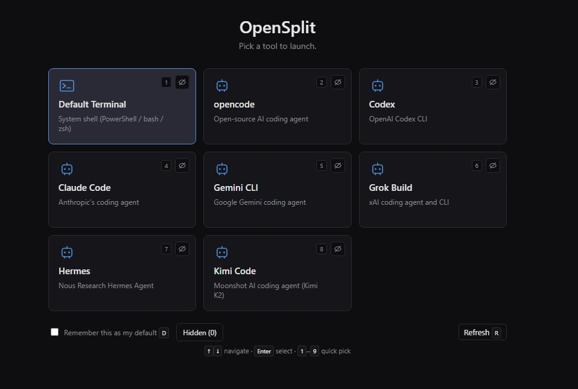

# OpenSplit

OpenSplit is a fast, cross-platform terminal harness for AI coding agents and developer shells. Launch opencode, codex, claude, grok-build, hermes, kimi-cli, aider, or any shell — then right-click to split panes horizontally or vertically, drag to resize, switch tools mid-session without losing context, and inherit your SSH session into every new split.

Built with Rust + Tauri 2 + Svelte 5 + xterm.js. Ships as a single native binary on Windows, with Linux and macOS builds possible from source.

## Screenshots



*Launcher picker: OpenSplit detects installed AI tools (opencode, Codex, Claude Code, Gemini CLI, Grok Build, Hermes, Kimi Code, and your system shell) and presents them as a keyboard-navigable grid. Press 1–9 to quick-pick, or check "Remember this as my default" to skip the picker next time.*


*Three-pane layout: opencode on the left, Codex CLI top-right, and Hermes bottom-right. Right-click any pane to split again, switch to a different tool, copy/paste, or close.*

## Download

Windows builds are available on the [Releases page](https://github.com/flashosophy/OpenSplit/releases).

Two options:

- **NSIS setup** (`OpenSplit_x.x.x_x64-setup.exe`) — installs to Program Files with a Start Menu shortcut.
- **MSI** (`OpenSplit_x.x.x_x64_en-US.msi`) — standard Windows installer, useful for enterprise / managed deployments.
- **Portable exe** (`opensplit-x.x.x-windows-x64.exe`) — single file, no installer needed. Drop it anywhere and run.

Before running a downloaded binary, compare its SHA256 hash against the value in the release notes. Optionally scan with [VirusTotal](https://www.virustotal.com/).

## What it does

**Auto-detects installed AI tools on launch.** The first time you run OpenSplit (and any time you click Refresh in Settings), it scans your PATH for known tools:

- [opencode](https://opencode.ai)
- [Codex CLI](https://github.com/openai/codex)
- [Claude Code](https://claude.ai/code)
- [Grok Build](https://x.ai/cli) (`grok-build`)
- [Hermes](https://hermes-agent.nousresearch.com/docs/user-guide/cli)
- [Kimi Code](https://kimi.moonshot.cn) (`kimi-cli`)
- [Gemini CLI](https://github.com/google-gemini/gemini-cli)
- [aider](https://aider.chat)
- cursor-agent, sgpt, and more
- Your system shell (PowerShell / bash / zsh)

If no AI tools are found it launches your shell directly. If exactly one is found it can be set as the default.

**Persistent launcher picker.** When no default is set, a centered picker shows detected tools as clickable cards. Keyboard-navigable (arrows, Enter, 1–9). Check "Remember as default" to skip the picker next time.

**Right-click pane splits.**

```
right-click a pane →
  Copy                    Ctrl+Shift+C
  Paste                   Ctrl+Shift+V
  ────────────────────────────────────
  Split Horizontal        Ctrl+Shift+H
  Split Vertical          Ctrl+Shift+E
  # If this pane is running ssh, these show as:
  Dup SSH Horizontal      Ctrl+Shift+H
  Dup SSH Vertical        Ctrl+Shift+E
  ────────────────────────────────────
  Switch to ▶
    ● opencode            (current, bullet)
      codex
      kimi-cli
      Shell
  Size ▶
      Square 1024 x 1024
      720p 1280 x 720
      1080p 1920 x 1080
      1440p 2560 x 1440
      720p 720 x 1280
      1080p 1080 x 1920
      1440p 1440 x 2560
  ────────────────────────────────────
  Close Pane              Ctrl+Shift+W
```

Split as many times as you like. Each split produces two independent PTY sessions.

**Switch tools without losing layout.** Right-click → Switch to → pick any detected tool. The current pane's process is closed and the new tool opens in its place in the same position, inheriting the working directory where possible.

**Set capture-friendly window sizes.** Right-click → Size → pick Square 1024x1024, horizontal 16:9 presets (720p, 1080p, 1440p), or vertical 9:16 presets (720p, 1080p, 1440p). The terminal panes refit after the window resize.

**Shell fallback on exit.** When a tool finishes (e.g. you Ctrl+C out of opencode), the pane respawns as your default shell instead of going blank or closing. From the shell you can run `opencode`, `codex`, or anything else. Close the pane when you are done.

**SSH duplicate panes.** When the pane is running `ssh`, the split menu changes to `Dup SSH Horizontal` and `Dup SSH Vertical`. OpenSplit does not copy your password, store your password, or clone the remote shell. It simply runs the same local SSH command again in the new pane.

```
# Example:
ssh my-server
```

If your normal local SSH setup can log in without a password, duplicated SSH panes do not ask for a password either. The recommended setup is an SSH key and a `~/.ssh/config` entry, for example:

```
Host my-server
  HostName example.com
  User my-user
  IdentityFile ~/.ssh/my_server_ed25519
  IdentitiesOnly yes
```

Then `ssh my-server` works the same in every pane. If `ssh my-server` still asks for a password in your regular terminal, OpenSplit will ask too.

**Working directory inheritance on split.** New panes open in the working directory of the foreground process in the source pane, not in `$HOME`.

**Activity indicator.** An unfocused pane that has received new output shows a pulsing blue dot in its header. The dot clears when you click into the pane.

**Copy / Paste.** `Ctrl+Shift+C` copies the xterm selection to the system clipboard. `Ctrl+Shift+V` pastes from clipboard using xterm's bracketed-paste mode (multi-line content is safe in shells that support it).

**Window size persistence.** The window remembers its size between sessions. First launch opens at 1/4 of your primary monitor, centered.

**Settings panel.** `Ctrl+,` or the gear icon opens Settings:

- Change or clear the default profile.
- Refresh tool detection (useful after installing a new CLI).
- Toggle SSH session inheritance.
- Shows the config file path and build version.

**Augmented PATH.** Shells spawned by OpenSplit receive an enriched PATH that includes `%APPDATA%\npm`, `~/.cargo/bin`, `~/.local/bin`, `~/.bun/bin`, scoop shims, pnpm, and other common per-user developer tool directories — even when OpenSplit was launched via a GUI shortcut that inherited only the narrow system PATH.

## Keyboard shortcuts

| Action | Shortcut |
|---|---|
| Copy selection | `Ctrl+Shift+C` |
| Paste | `Ctrl+Shift+V` |
| Split horizontal (panes stacked) | `Ctrl+Shift+H` |
| Split vertical (panes side by side) | `Ctrl+Shift+E` |
| Close focused pane | `Ctrl+Shift+W` |
| Open Settings | `Ctrl+,` |
| Quit | `Ctrl+Q` |

## Configuration

Config file locations:

- Windows: `%APPDATA%\opensplit\config.toml`
- Linux: `~/.config/opensplit/config.toml`
- macOS: `~/Library/Application Support/opensplit/config.toml`

A default config is created on first launch. Example:

```toml
# Set a default tool to skip the picker on launch.
# Remove or comment out to always show the picker.
default_profile = "opencode"

# Inherit SSH session into new splits (default: true).
ssh_inherit = true

# Optional: add custom profiles or override defaults.
[profiles.myserver]
command = "ssh"
args = ["user@myserver.example.com"]
```

## CLI usage

```
opensplit                  # launcher picker (or default profile if set)
opensplit codex            # launch the named profile or detected tool
opensplit -- bash -l       # raw command, bypasses profile lookup
```

## Build from source

### Prerequisites

- **Rust stable** from [rustup.rs](https://rustup.rs/)
- **Node.js 20+** from [nodejs.org](https://nodejs.org/)
- **WebView2 runtime** — ships with Windows 11; [download for Windows 10](https://developer.microsoft.com/en-us/microsoft-edge/webview2/)
- Visual Studio Build Tools (Windows) or equivalent C++ toolchain
- On Linux: Tauri's [system dependencies](https://tauri.app/start/prerequisites/#linux)

On this workstation, known-good tool locations:

```
C:\Program Files\nodejs\node.exe
C:\Users\flash\.cargo\bin\cargo.exe
```

### Install dependencies

```powershell
npm install
```

### Dev mode (hot-reload frontend, live Rust backend)

```powershell
# Ensure cargo is on PATH first:
$env:PATH = "$env:USERPROFILE\.cargo\bin;$env:PATH"
npm run tauri -- dev
```

### Windows release build

```powershell
.\Build-Windows.ps1
```

Produces:

```
dist\opensplit-26.5.16-windows-x64.exe         # portable single-file exe
dist\opensplit-26.5.16-windows-x64.exe.sha256  # SHA256 checksum

src-tauri\target\release\bundle\nsis\OpenSplit_26.5.16_x64-setup.exe
src-tauri\target\release\bundle\msi\OpenSplit_26.5.16_x64_en-US.msi
```

### Manual build (any platform)

```powershell
npm run build                       # frontend
cargo build --release \
  --manifest-path src-tauri/Cargo.toml
# or via npm:
npm run tauri -- build
```

### Check before committing

```powershell
npm run check                       # Svelte type check
cargo check --manifest-path src-tauri/Cargo.toml
```

## Architecture

```
opensplit/
├── src-tauri/                  Rust backend (Tauri 2)
│   ├── src/
│   │   ├── main.rs             binary entry point
│   │   ├── lib.rs              Tauri setup, plugin registration, CLI parsing
│   │   ├── config.rs           TOML config, profile resolution, save/load
│   │   ├── detect.rs           PATH scan for known AI CLIs and shells
│   │   ├── pty.rs              portable-pty wrapper, PATH augmentation,
│   │   │                       .cmd/.bat→cmd.exe wrapping, reader/waiter threads
│   │   ├── session.rs          foreground-process detection, SSH inheritance,
│   │   │                       cwd inheritance on split
│   │   └── ipc.rs              all Tauri command handlers, AppState
│   ├── Cargo.toml
│   ├── build.rs                embeds git hash + date at compile time
│   └── tauri.conf.json
├── src/                        Svelte 5 frontend
│   ├── lib/
│   │   ├── ipc.ts              typed Tauri command wrappers
│   │   ├── PaneTree.ts         recursive binary tree (Leaf | Split)
│   │   ├── terminalInstances.ts  persistent xterm instances (survives splits)
│   │   ├── terminalRegistry.ts   per-pane handle registry for copy/paste
│   │   ├── clipboard.ts        clipboard read/write via Tauri plugin
│   │   └── theme.ts
│   └── components/
│       ├── App.svelte          root: boot, routing, keyboard, all actions
│       ├── PaneView.svelte     recursive pane tree renderer
│       ├── Terminal.svelte     thin xterm host (borrows persistent instance)
│       ├── Splitter.svelte     drag-resize divider
│       ├── ContextMenu.svelte  right-click menu with Switch submenu
│       ├── LauncherPicker.svelte  first-launch tool picker
│       └── SettingsPanel.svelte   settings overlay
└── Build-Windows.ps1           Windows release build script
```

Pane layout is a recursive binary tree:

```ts
type PaneNode =
  | { kind: "leaf"; id: string; paneId: string; profile: string | null; title: string }
  | { kind: "split"; id: string; direction: "h" | "v"; ratio: number; a: PaneNode; b: PaneNode }
```

Splitting a leaf replaces it with a split node containing the original leaf and a new one. Closing a leaf promotes its sibling. Switching replaces the paneId on the leaf in-place using `{#key node.paneId}` in the view so xterm re-attaches cleanly.

xterm instances live in `terminalInstances.ts` keyed by paneId, independent of the component tree. When a pane is split or re-rendered, the view's `attach()` call moves the existing xterm DOM element into the new host instead of creating a new canvas. Scrollback and cursor position survive splits.

## Versioning

Build version is embedded at compile time as `{semver} · {date} · {hash}` and shown in the Settings panel footer.

## For AI agents

If you are an AI coding agent working in this repository:

1. Do not commit `node_modules/`, `dist/`, `src-tauri/target/`, or `src-tauri/gen/`.
2. Do not commit `.env*` files, API keys, or secrets of any kind.
3. Rust changes require rebuilding. Svelte-only changes rebuild in ~3 seconds. Rust rebuilds take 2–5 minutes on a warm incremental build.
4. The binary name is `opensplit` (not `opensplit-lib`). The lib crate is `opensplit_lib`.
5. Cargo is at `$env:USERPROFILE\.cargo\bin\cargo.exe` on this workstation. Add it to PATH before running cargo commands: `$env:PATH = "$env:USERPROFILE\.cargo\bin;$env:PATH"`.
6. npm may resolve to a broken shim on Windows. If `npm` fails, use `& "C:\Program Files\nodejs\npm.cmd"` directly.
7. Before handing off a release binary, run `.\Build-Windows.ps1` from the repo root.
8. After a successful build, the portable exe is in `dist\`, installers in `src-tauri\target\release\bundle\`.
9. Commit first, then build, so the release binary contains the correct git hash in its version string.
10. For public binary releases, include SHA256 hashes in release notes. The build script prints them.
11. The config file written on first run lives at `%APPDATA%\opensplit\config.toml` on Windows.
12. `OPENSPLIT_LOG=debug` enables verbose PTY/session/detection tracing to stderr.
13. `tauri-plugin-window-state` restores SIZE only (not position) to avoid off-screen windows on multi-monitor setups.
14. Pane tree mutations are immutable transforms that return a new root. Svelte sees the change reactively.

## License

MIT — see [LICENSE](./LICENSE).
